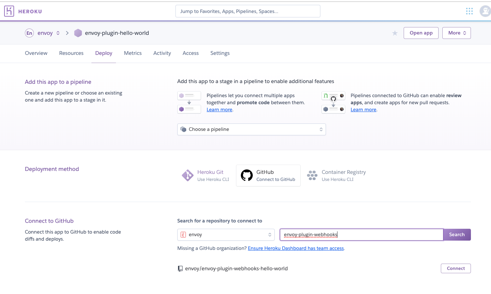

# Your First Plugin

## From Zero to Plugin

The plugin development process is not unlike creating a Slack app or bot, where you build and host your web app yourself, and let Slack know about it by filling out a form. In Envoy's case, the form is the [Integration Builder](../the-integration-builder/).

## Hello World

Plugins typically have a few commonalities:

* setup steps
* events they listen for
* some interaction back to Envoy

In order to illustrate these concepts, we'll be building a simple plugin that says hello and goodbye to visitors.

### Setup Steps

When our Hello World plugin is installed, we'd like the installer to be able to set their desired greetings and salutations. To do this, we'll need to render a dropdown with our greeting options, and allow them to pick one.


### Events

In order to greet to our guests, we'll need to listen for the "entry sign in" and "entry sign out" events, and handle those appropriately. 

On entry sign in, we'll create a personalized greeting for our visitor using the greeting selected during setup as well as the visitor's name. 

On entry sign out, we'll do the same, and as an added bonus, we'll add the duration of their visit to the message.

### Attachments

The personalized messages we've created need to find their way back to the visitor somehow. We could send them an email or SMS, but to illustrate the attachment system, we can have those greetings appear in the Envoy dashboard for the receptionist.

## Development

To build our plugin, we're going to create a Node.js application. Note that any language can be used \(as illustrated in our [API reference](../apis/)\), but currently only a [Node.js SDK](the-node.js-sdk/) is available.

For deployment, we will use GitHub and Heroku for simplicity.

### Setup

Start by creating a repository on GitHub and cloning it to your local machine. During GitHub repo setup, it's a good idea to select the option for GitHub to automatically include a README and a `.gitignore` file for Node.js.

```bash
git clone https://github.com/envoy/my-plugin.git
```

Replace `https://github.com/envoy/my-plugin.git` with the clonable URL to your repo.

In the plugin directory, initialize the Node app.

```bash
npm init --yes
```

A `package.json` file should have been created. This file describes your application. In this file, add the following key to the JSON:

```javascript
"engines": {
  "node": "10.x"
}
```

Later when we deploy to Heroku, this allows it to determine the deployment runtime.

Next, if you didn't auto-generate a `.gitignore` file from GitHub, create one now with the following contents:

```text
node_modules
.env
```

Now to install our dependencies. We're going to install [Express.js](https://expressjs.com) and our [Node SDK](https://www.npmjs.com/package/@envoy/envoy-integrations-sdk). Most integrations also talk to external APIs, so you'll often find yourself installing an HTTP request library as well, like [axios](https://www.npmjs.com/package/axios), [superagent](https://www.npmjs.com/package/superagent), or [request](https://www.npmjs.com/package/request) \(none of these are necessary for this tutorial though\).

#### Express.js

```bash
npm install --save express
```

#### Envoy's Node.js SDK

```bash
npm install --save @envoy/envoy-integrations-sdk
```

Once installation is complete, a `package-lock.json` file should have been created. This file locks down your installed dependencies to specific versions. Be sure to add this file to git.

Now create an `index.js` file. This is where we'll write our server script.

### The code

In the `index.js` file, start by including the dependencies we installed.

```javascript
const express = require('express');
const { middleware, errorMiddleware } = require('@envoy/envoy-integrations-sdk');
```

Next, initialize Express.js with our middleware.

```javascript
const app = express();
app.use(middleware());
```

#### Setup Routes

Now we can use our `app` object to define our app's endpoints. Let's start with a [route](./#key-concepts) that sends back available options for the "preferred hello" dropdown that we saw in our setup steps screenshot.

```javascript
app.post('/hello-options', (req, res) => {
  res.send([
    {
      label: 'Hello',
      value: 'Hello',
    },
    {
      label: 'Hola',
      value: 'Hola',
    },
    {
      label: 'Aloha',
      value: 'Aloha',
    },
  ]);
});
```

In the above, we're sending back a JSON array of objects where each object has a `label` and `value`. Typically these are not the same, but for our case, we'd like what is displayed on the front-end to also be the value we receive later.

Now do something similar for "goodbye".

```javascript
app.post('/goodbye-options', (req, res) => {
  res.send([
    {
      label: 'Goodbye',
      value: 'Goodbye',
    },
    {
      label: 'Adios',
      value: 'Adios',
    },
    {
      label: 'Aloha',
      value: 'Aloha',
    },
  ]);
});
```

#### Event Handlers

Now we can create our "entry sign in" [worker](./#key-concepts).

```javascript
app.post('/entry-sign-in', async (req, res) => {
  const envoy = req.envoy; // our middleware adds an "envoy" object to req.
  const job = envoy.job;
  const hello = envoy.meta.config.HELLO;
  const visitor = envoy.payload;
  const visitorName = visitor.attributes['full-name'];
  
  const message = `${hello} ${visitorName}!`; // our custom greeting
  await job.attach({ label: 'Hello', value: message }); // show in the Envoy dashboard.
  
  res.send({ hello });
});
```

In order to have our message displayed in the Envoy dashboard, we're attaching some data to the [job](./#key-concepts).

Finally, we're sending back a 200 response with some debugging data. Read more about responses [here](plugin-responses.md).

Now for the "entry sign out" worker.

```javascript
app.post('/entry-sign-out', async (req, res) => {
  const envoy = req.envoy; // our middleware adds an "envoy" object to req.
  const job = envoy.job;
  const goodbye = envoy.meta.config.GOODBYE;
  const visitor = envoy.payload;
  const visitorName = visitor.attributes['full-name'];

  const message = `${goodbye} ${visitorName}!`;
  await job.attach({ label: 'Goodbye', value: message });
  
  res.send({ goodbye });
});
```

#### Wrapping Up

Now that our setup and event endpoints are ready, we can finish our script by making sure we use our `errorMiddleware`, and creating a server on a specific port.

```javascript
app.use(errorMiddleware());

const listener = app.listen(process.env.PORT || 0, () => {
  console.log(`Listening on port ${listener.address().port}`);
});
```

## Deploying to Heroku

First, be sure to push up all your changes to Github.

Next, log in to Heroku, click on New &gt; Create new app.


After filling out the name, click "Create app".

Next, select GitHub as the deployment method,  search for your repo, and click "Connect".



Then head to the Settings section and add placeholders for the `ENVOY_CLIENT_ID` and `ENVOY_CLIENT_SECRET` environment variables. [The Node.js SDK](the-node.js-sdk/) uses these values to authenticate with Envoy.


Finally, scroll to the "Domains and certificates" area, and copy your app's URL.


## Registering with Envoy

Now that our code is complete and deployed, we need to let Envoy know about our plugin. We do that with the [Integration Builder](../the-integration-builder/).

For an in-depth tutorial on the builder, see [here](../the-integration-builder/). As a quickstart tutorial, we are going to jump right in to the "create new" section. Fill out each section as shown.


For all the URL fields below, be sure to replace `https://my-heroku-url` with the URL you copied from Heroku. Leave the paths to each endpoint the same.


### Details

Fill in the basic details about the plugin.


For the logo, we can use this image: [https://dashboard.envoy.com/assets/images/logo-small-red.svg](https://dashboard.envoy.com/assets/images/logo-small-red.svg)

### Events

Here's where we define the URLs to each of our workers.


### Setup Steps

Create a single setup step that allows the installer to select their preferred greetings.


Click "Save Integration".

After saving, your client credentials will be visible. Go back to your placeholder Heroku environment variables that we created earlier and paste in the values for the client ID and secret.

You can now head to the "Deploy" section of Heroku and scroll to the bottom to manually deploy your plugin.


Now that your app has the appropriate values, head back to the Integration Builder and check the "Yes, display on the Integrations page" box and click "Save Integration" once more.

## Mission Complete

Your plugin should now be available in the Envoy dashboard's Integrations page! Go ahead and run through the installation process of your brand new plugin, and it should be active once complete. Try signing in a visitor to see it in action.

Note that your plugin is private to your company. To make your plugin public \(available to all companies\), email us at [integrations@envoy.com](mailto:integrations@envoy.com).

